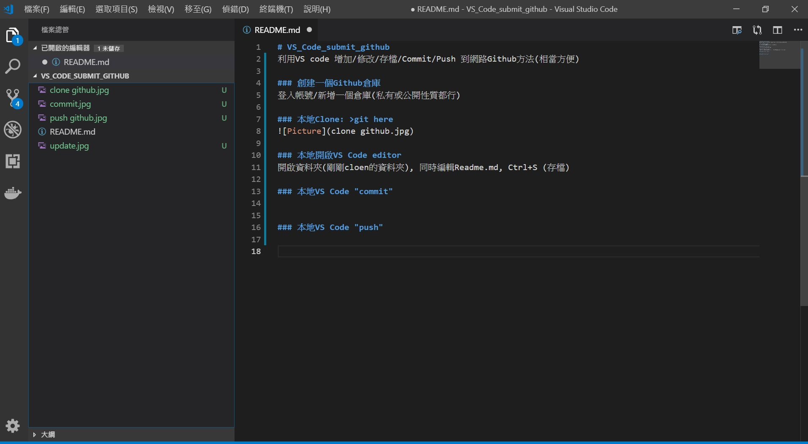
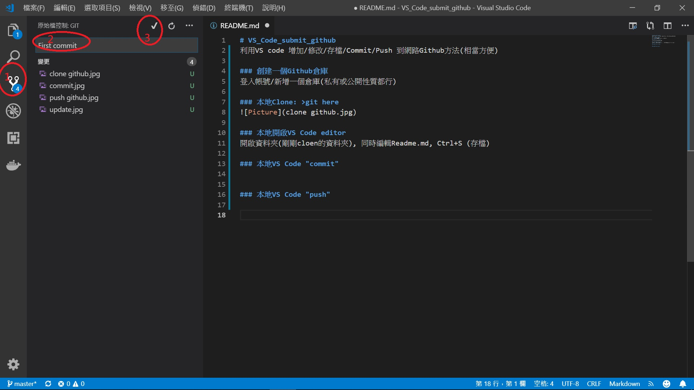

# VS_Code_submit_github
利用VS code 增加/修改/存檔/Commit/Push 到網路Github方法(相當方便)

### 創建一個Github倉庫
登入帳號/新增一個倉庫(私有或公開性質都行)

### 本地Clone: >git here

### 本地開啟VS Code editor
開啟資料夾(剛剛cloen的資料夾), 同時編輯Readme.md, Ctrl+S (存檔)

### 本地VS Code "commit" 

### 本地VS Code "push"

