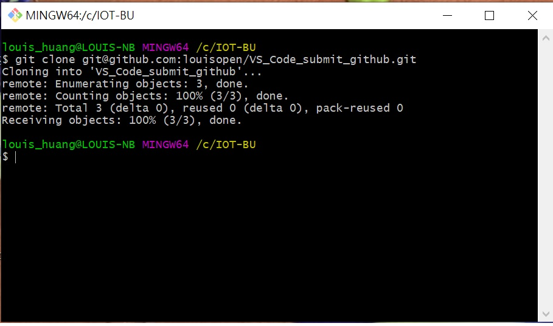
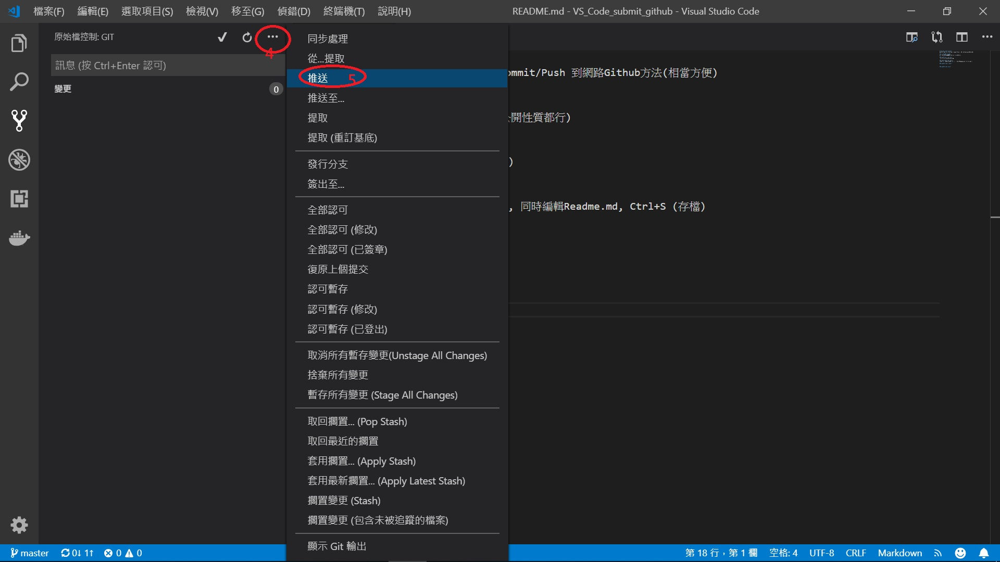

# VS_Code_submit_github
善加利用VS code編輯器功能, 增加/修改/存檔/Commit/Push 到網路Github方法(相當方便)

使用方法因人而異, 我覺得先在Github創建遠地倉庫, 在本地命令列下Clone遠地倉庫之後在使用VS Code會直接方便, 如下:

#### 創建一個Github倉庫
登入Github註冊帳號/並新增一個遠地倉庫(私有或公開性質都行)

例如:https://github.com/louisopen/VS_Code_submit_github

#### 本地Clone: >git here
直接進入到準備創建本地庫的Command line 馬上下指令"創建複製到本地": 

git clone https://github.com/louisopen/VS_Code_submit_github

或是: 

git clone git@github.com:louisopen/VS_Code_submit_github.git

#### 本地開啟VS Code editor
開啟資料夾(剛剛cloen的資料夾), 同時編輯Readme.md, Ctrl+S (存檔)

#### 本地VS Code "commit" 
Commit 訊息一定要填文字(簡單有意義的敘述)

#### 本地VS Code "push"
每次在VS Code編輯完成都要按圖面上的1,2,3,4,5順序按下

